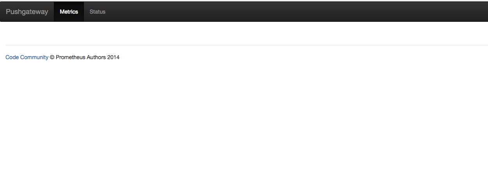
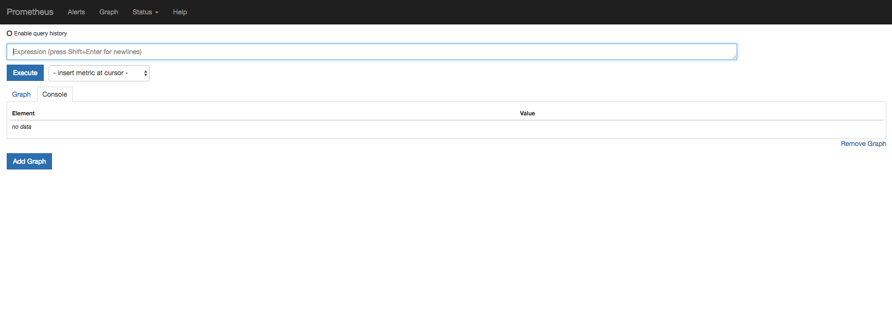

메트릭은 시스템 성능을 측정하는 툴로, IOST에서는 [Prometheus](https://prometheus.io/)를 이용합니다.

## Prometheus 배포하기

IOST 노드를 구동하고 있고, 노드의 메트릭 정보를 알고 싶다면 다음 절차를 따라주세요:

* prometheus `pushgateway` 실행

```
docker run -d -p 9091:9091 prom/pushgateway
```

설치가 끝난 후에, 브라우저에서 `[pushgateway_ip]:9091` URL에 접속해보면 다음과 같은 페이지를 보실 수 있습니다.(`[pushgateway]` 는 도커가 배포된 IP를 가리킵니다.):



* prometheus 서버 구동하기

```
docker run -d -p 9090:9090 -v /tmp/prometheus.yml:/etc/prometheus/prometheus.yml prom/prometheus
```

* `promethus.yml` 파일 설정하기

```
global:
  scrape_interval: 15s
  external_labels:
    monitor: 'codelab-monitor'
scrape_configs:
  - job_name: 'prometheus'
    scrape_interval: 5s
    target_groups:
      - targets: ['pushgateway_ip:9090']
```

`pushgateway_ip` 를 반드시 도커의 IP 주소로 변경해주세요.



* `iserver.yml` 파일 설정하기

```
metrics:
	pushAddr: "pushgateway_ip:9090"
	username: ""
	password: ""
	enable: true
	id: "defined_by_yourself"
```


`iserver.yml` 파일의 `metrics` 항목에 위와 같은 설정을 입력해주세요.

위의 절차를 수행하셨다면, IOST의 메트릭 정보를 "prometheus\_ip:9091" 에서 확인하실 수 있습니다. 보여지는 메트릭 정보는 다음과 같습니다:

```
iost_pob_verify_block: Number of verify blocks
iost_pob_confirmed_length: Block height
iost_tx_received_count: Number of transactions received
iost_txpool_size: Number of transactions to pack
iost_p2p_neighbor_count: Number of neighbors
iost_p2p_bytes_out: Bytes sent
iost_p2p_packet_out: Packets sent
iost_p2p_bytes_in: Bytes received
iost_p2p_packet_in: Packets received
```

## 메트릭 권한 설정

외부에서 메트릭 정보를 넣는 것을 방지하고 싶다면, nginx instance를 배포하여 권한 설정을 추가 할 수 있습니다. 자세한 사항은 https://prometheus.io/docs/guides/basic-auth/ 를 참조해주세요.

nginx 배포가 끝난 후, `username` 과 `password` 필드를 `iserver.yml` 설정 파일에 입력해주세요.
